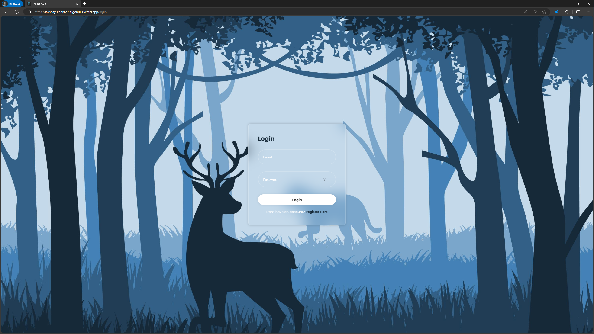
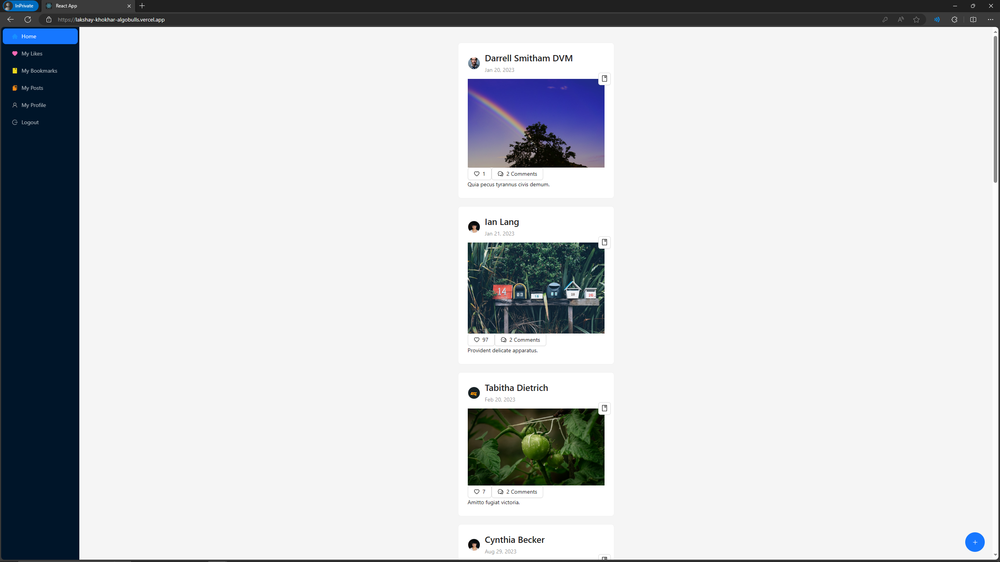
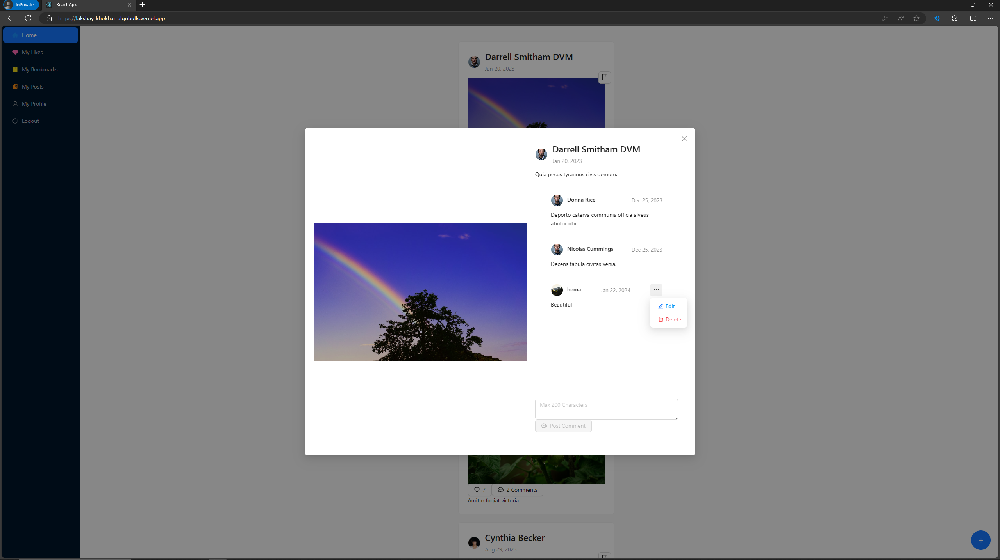
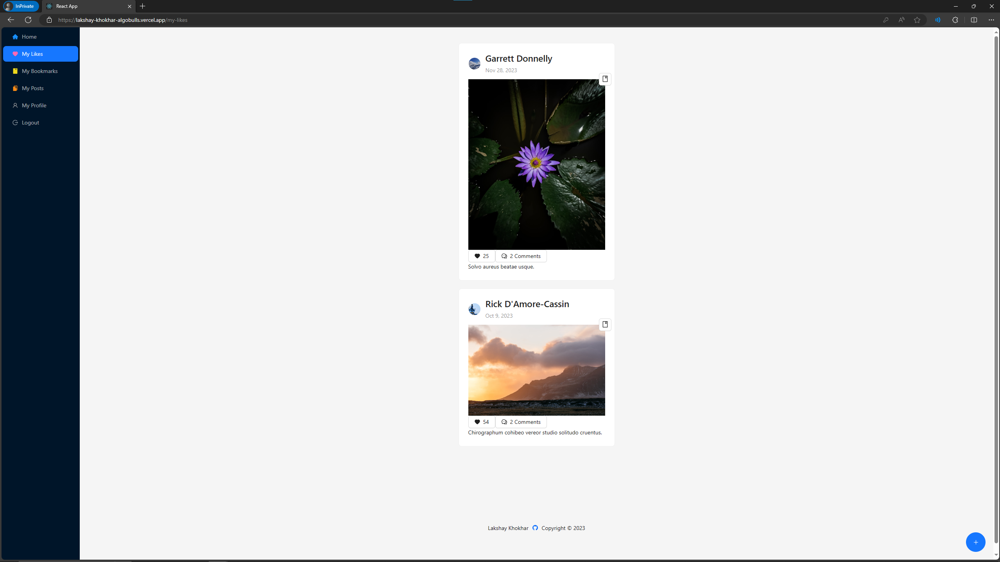
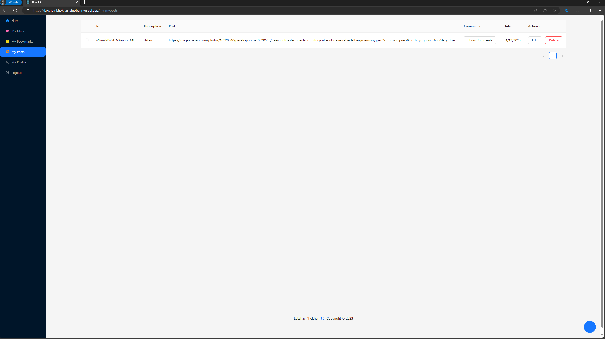
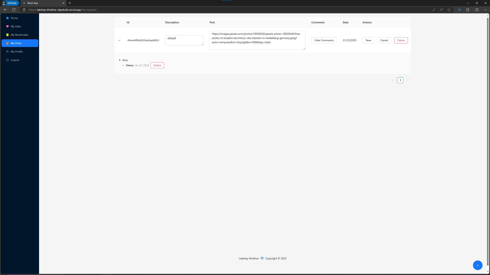
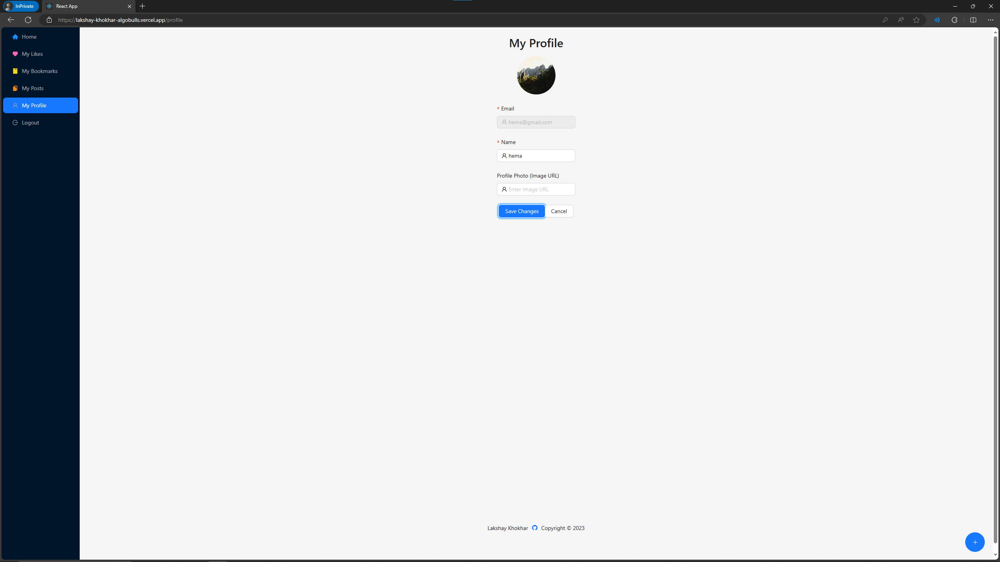
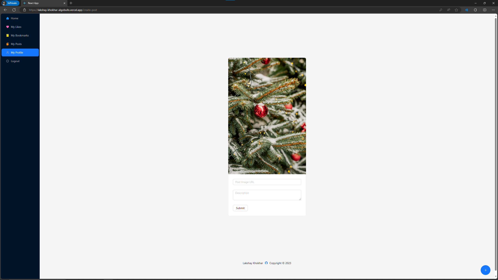

# Getting Started

## Installation

```bash
npm install
```

## Running the app

```bash
npm start
```

open [http://localhost:3000](http://localhost:3000) to view it in the browser.

## Credentials

I created a dummy user for the project with the following information: email: "lakshaykhokhar2003@gmail.com" and
password: "123456".

You can also create your own user by registering, but note that your email address and
password are needed to log in.

## API Endpoints

### GET POST PUT PATCH DELETE /api/posts

This endpoint should return all the posts in the database

### GET POST PUT PATCH DELETE /api/user/

This endpoint contains the signup and login details of the users.

The Apis are mentioned in the .env file for the project.

## Screenshots

### Login Page


### Home Page


### Posts


### Liked Posts


### My Posts


### Edit My Post


### My Profile


### Create Post
